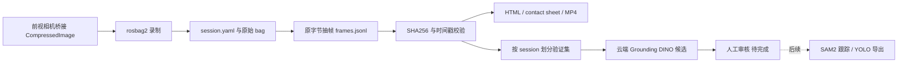

# 架构、参数与接口

## 源码职责

| 位置 | 职责 |
|---|---|
| `src/u_robot_duck_dataset/session.py` | session 建立、字段检查、原子写 YAML、录制状态 |
| `extract.py` | rosbag 读取、时间窗口/采样、保存原压缩数据与 manifest |
| `validate.py` | 帧存在性、解码、尺寸、哈希、严格递增时间戳与警告 |
| `visualize.py` | contact sheet、ffmpeg 预览、session HTML |
| `index.py` / `web.py` | 数据总览与本地 HTTP/MJPEG 服务 |
| `cli.py` | CLI 参数与调度 |
| `scripts/` | 录制、处理、测试和固定历史验证集构建 |
| `cloud/` | 独立 GPU 环境安装与候选扫描 |

## CLI

`./scripts/duck_dataset SUBCOMMAND --help` 给出完整参数。安装 Python 包后入口为 `duck-dataset`。

| 子命令 | 必需参数 | 常用可选参数与默认 |
|---|---|---|
| `init` | `--scene` | `--root` 当前用户数据目录；`--duck-present unknown`；`--duck-count` 未指定 |
| `mark-recording` / `mark-recorded` | `--session --bag` | 由录制脚本调用 |
| `mark-record-failed` | `--session --reason` | 记录失败原因 |
| `extract` | `--session` | `--sample-fps 0` 全帧；`--start-sec 0`；可设 `--end-sec --max-frames --bag --topic --overwrite` |
| `validate` | `--session` | 默认核对哈希；`--skip-hashes` 跳过，正式追溯检查不应跳过 |
| `visualize` | `--session` | `--samples 24 --columns 4 --thumbnail-width 320 --thumbnail-height 180`；`--preview-fps 0` 估算 |
| `index` | 无 | `--root`，更新磁盘上的总览 HTML |
| `serve` | 无 | `--root --bind 127.0.0.1 --port 8090 --topic /camera/front/image/compressed` |

`--root` 默认为 `U_ROBOT_DUCK_DATA_ROOT`，未设置则使用 `~/data/duck_dataset`。`configs/duck.yaml` 是参考文件，`future_inference` 为规划字段，不连接云端脚本；实际模型与阈值以 cloud CLI 为准。

## 状态与输出

典型状态经历 `initialized → recording → recorded → extracted → validated`；录制失败为 `record_failed`。校验失败会写 `validation.status: error`，不要仅凭顶层状态判断合格。每次处理会更新 session 元数据和派生报告，原始 bag 不由抽帧工具改写。

网页服务从数据根提供文件，没有上传、人工 bbox 编辑或自动标注接口。云端 JSONL 是像素 `xyxy` 坐标和模型分数；显示时裁剪到图片边界，原始预测坐标仍可越界。后续导出必须另外检查坐标与标签有效性。
