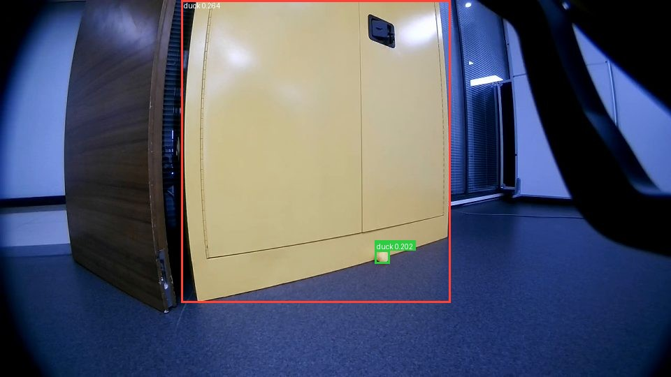
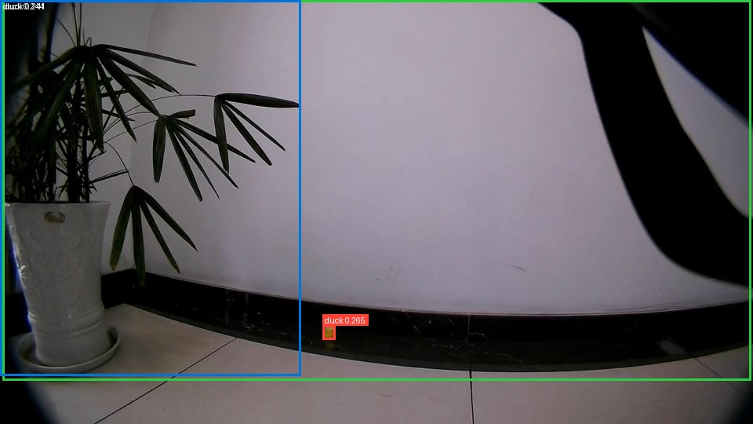
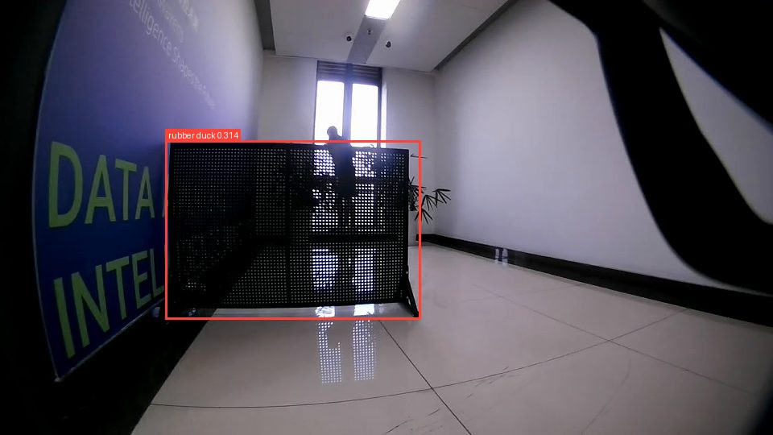
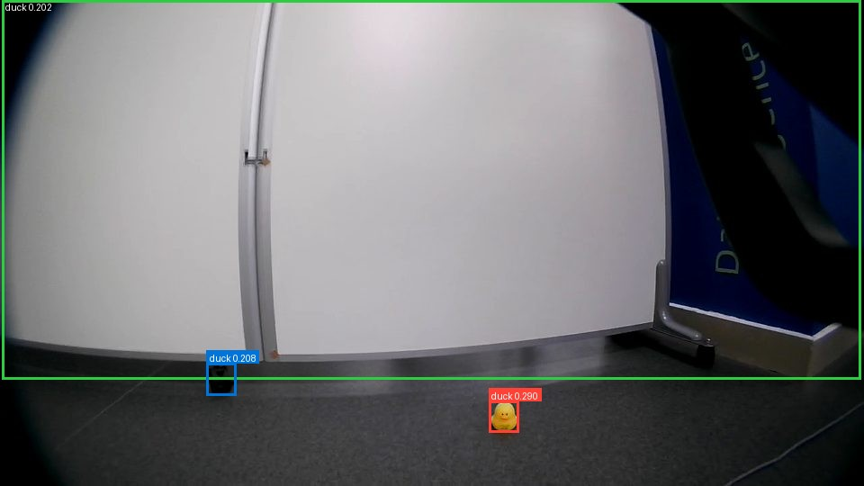

# calibration 候选结果与人工审核

2026-09-11 完成 100 张 calibration、3 个提示词的 Grounding DINO 扫描。本页基于已有结果整理，2026-09-13 发布准备时只读检查了本地报告与预测，没有重新运行模型。

**这些是未审核候选，不是人工标注，也不是可靠的训练标签。** 尚未冻结提示词、阈值或过滤规则；60 张 holdout、SAM2 传播及 YOLO 导出/训练/部署均未完成。

## 实测输出数量

每格为“有检测的图片数 / 候选框数”，图片总数 100；text threshold 为 0.15。

| 提示词 | 0.15 | 0.20 | 0.25 | 0.30 | 0.35 |
|---|---:|---:|---:|---:|---:|
| yellow rubber duck | 92 / 228 | 63 / 91 | 17 / 19 | 1 / 1 | 0 / 0 |
| rubber duck | 91 / 198 | 56 / 79 | 18 / 19 | 0 / 0 | 0 / 0 |
| yellow duck toy | 92 / 230 | 63 / 90 | 15 / 17 | 1 / 1 | 0 / 0 |

300 条图像/提示词记录共保留 656 个候选框（最低阈值 0.15）。脚本记录耗时 50.838 秒，不含模型加载和后续总览生成；该数值是历史特定环境的一次记录，不是性能基准。无人工真值时不能从候选数量推导 precision、recall、mAP 或“最佳提示词”。

## 精选候选图

四张图片来自原报告 `yellow_rubber_duck` 叠加图，visual threshold 为 0.20；按原 JPEG 字节复制，无重绘或模型再推理。完整原图、全量报告和审核表不随仓库分发。[素材来源清单](images/README.md) 保存原图名与 SHA256。

### 远距离小目标与柜子大框

小目标候选约 0.202，柜子大框约 0.264。目视判断柜子框很可能是误检，但尚未经正式人工审核；提高阈值可能保留背景大框而去掉小目标。

### 小目标与植物、墙面候选

小鸭候选约 0.265，同时出现跨植物和墙面的大框。框的数量不能当成鸭子的数量。

### 高分椅背候选

该提示词唯一达到 0.30 的候选约 0.314，落在椅背。较高分数也可能对应背景，不能直接作为可靠跟踪种子。

### 近处目标、暗处小框与墙面大框

近处目标约 0.290，暗处小框约 0.208，墙面大框约 0.202。这些观察用于指出审核重点，不能替代人工真值、逐目标匹配或漏检统计。

## 人工审核流程

扫描器生成 JSONL、图片和 HTML；历史实验另有逐图/逐候选 CSV，但其生成脚本不在本仓库中。本版没有自动同步、自动评价或 bbox 编辑 UI。使用自己的标注工具/表格建立审核主版本：

1. 先看未叠框原图，记录每张图可见目标数、困难条件、审核人和备注。只有确认没有鸭子才记 0；未知留空。
2. 为同一图的每只可见鸭子分配稳定 ID，并记录人工 bbox。不同提示词命中同一目标时沿用相同 ID。
3. 对照 `predictions.jsonl` 的原始候选顺序，记录图名、提示词、从 0 开始的 `candidate_index`、TP/FP/uncertain 和对应目标 ID。叠加图隐藏了低分候选，不能用可见框顺序替代原始索引。
4. 同一提示词/阈值下每只真鸭最多匹配一个 TP；重复框单独标注并在评价时按既定规则计 FP。遮挡或模糊不确定时保留 uncertain。
5. 检查没有候选覆盖的可见鸭子并记录漏检；所有可见目标和候选都检查完才把该图改为 reviewed。
6. 保存原始预测、人工 bbox、审核修订、匹配/IoU 规则和主版本位置。用 calibration 选择配置后冻结，最后对 holdout 做独立验证。

单纯记录候选 TP/FP 和可见数量不足以完成标准 IoU/mAP 评价；必须建立人工 bbox 与明确的匹配规则。面积/形状过滤、分块放大或其他 checkpoint 对照仍属于后续实验方向，不能预先当成已经有效的修复。
